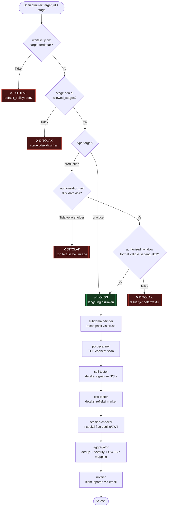

# Pipeline Agent Security Scanner — AI Hackfest 2026

Sistem deteksi kerentanan website otomatis, berbasis prinsip **detection-only**
dan **default-deny**. Setiap komponen memverifikasi ulang otorisasi target
secara independen sebelum bertindak — tidak ada tahap yang saling percaya
begitu saja.

## Daftar isi

- [Arsitektur](#arsitektur)
- [Prasyarat](#prasyarat)
- [Struktur direktori](#struktur-direktori)
- [Setup dari nol](#setup-dari-nol)
- [Menjalankan pipeline](#menjalankan-pipeline)
- [Script test semua service](#script-test-semua-service)
- [Format `authorized_window` (PENTING)](#format-authorized_window-penting)
- [Troubleshooting](#troubleshooting)
- [Referensi cepat tiap service](#referensi-cepat-tiap-service)

---

## Arsitektur

```
scope-gate → subdomain-finder → port-scanner → sqli-tester
  → xss-tester → session-checker → aggregator → notifier
```

Urutan panggilan ditentukan oleh **call sequence di Hermes Orchestrator**,
bukan oleh urutan block di `docker-compose.yml`.

### Flowchart lengkap



Setiap service scanner (`S1`–`S5` di atas) sebenarnya menjalankan **ulang**
seluruh alur validasi di kotak kuning (`WL` → `StageCheck` → `TypeCheck` →
dst) untuk dirinya sendiri sebelum bertindak — bukan cuma mengandalkan hasil
dari `scope-gate`. Diagram di atas disederhanakan jadi satu alur validasi
supaya mudah dibaca; di implementasi nyata, validasi itu terjadi berulang
kali secara independen di setiap kotak `S1`–`S5` (prinsip *defense in
depth* yang dijelaskan di bawah).

**Prinsip inti:**
- `whitelist.json` adalah satu-satunya sumber kebenaran target yang sah.
  Default policy: **deny**.
- Setiap service scanner membaca ulang `whitelist.json` sendiri sebelum
  request apa pun ke target (*defense in depth*).
- Target production wajib `authorization_ref` (nomor izin) dan
  `authorized_window` (jendela waktu) diisi data asli sebelum diloloskan.
- `sqli-tester` dan `xss-tester` murni deteksi sinyal, tidak pernah
  mengeksekusi payload destruktif.

---

## Prasyarat

- VPS dengan Docker + Docker Compose terpasang
- Akses `root` atau user dengan izin Docker
- Domain/target latihan (DVWA) dan/atau surat izin tertulis untuk target
  produksi
- Akun Gmail untuk notifikasi (App Password, lihat bagian notifier)

---

## Struktur direktori

```
/home/
├── docker-compose.yml
├── .env                              # kredensial SMTP -- JANGAN commit ke git
│
├── config/
│   ├── whitelist.json                # daftar target resmi
│   ├── test_points.json              # titik uji sqli-tester
│   ├── xss_test_points.json          # titik uji xss-tester
│   └── session_test_points.json      # titik uji session-checker
│
└── project/service/
    ├── scope-gate/          {app.py, Dockerfile, requirements.txt}
    ├── subdomain-finder/    {app.py, Dockerfile, requirements.txt}
    ├── port-scanner/        {app.py, Dockerfile, requirements.txt}
    ├── sqli-tester/         {app.py, Dockerfile, requirements.txt}
    ├── xss-tester/          {app.py, Dockerfile, requirements.txt}
    ├── session-checker/     {app.py, Dockerfile, requirements.txt}
    ├── aggregator/          {app.py, Dockerfile, requirements.txt}
    └── notifier/            {app.py, Dockerfile, requirements.txt}
```

---

## Setup dari nol

### 1. Siapkan direktori

```bash
mkdir -p /home/config
mkdir -p /home/project/service/{scope-gate,subdomain-finder,port-scanner,sqli-tester,xss-tester,session-checker,aggregator,notifier}
```

### 2. Isi `config/whitelist.json`

```json
{
  "authorized_targets": [
    {
      "id": "practice-target",
      "type": "practice",
      "host": "dvwa-target",
      "internal_only": true,
      "allowed_stages": ["subdomain", "portscan", "sqli", "xss", "session"],
      "note": "Target latihan DVWA, berjalan lokal di VPS, tidak diekspos ke publik"
    },
    {
      "id": "school-domain",
      "type": "production",
      "host": "GANTI-DENGAN-DOMAIN-ASLI",
      "internal_only": false,
      "allowed_stages": ["subdomain", "portscan", "sqli", "xss", "session"],
      "sqli_mode": "detection_only",
      "xss_mode": "detection_only",
      "authorization_ref": "ISI: nomor surat izin dari kepala sekolah",
      "authorized_window": "ISI: YYYY-MM-DD HH:MM..YYYY-MM-DD HH:MM",
      "note": "WAJIB ada bukti izin tertulis sebelum mengaktifkan target ini"
    }
  ],
  "default_policy": "deny",
  "comment": "Target apapun yang tidak ada di daftar ini WAJIB ditolak scope-gate."
}
```

> **Jangan** isi `authorization_ref`/`authorized_window` dengan data asli
> sampai izin tertulis benar-benar ada di tangan. Scope-gate akan menolak
> target production selama field ini masih placeholder — itu memang
> desainnya.

### 3. Isi file titik uji (kosongkan array target yang belum siap diuji)

```bash
cat > /home/config/test_points.json << 'EOF'
{
  "practice-target": [
    {
      "url": "http://dvwa-target/vulnerabilities/sqli/",
      "method": "GET",
      "param": "id",
      "baseline": "1",
      "extra_params": {"Submit": "Submit"},
      "cookies": {"PHPSESSID": "GANTI", "security": "low"}
    }
  ],
  "school-domain": []
}
EOF

cat > /home/config/xss_test_points.json << 'EOF'
{
  "practice-target": [
    {
      "url": "http://dvwa-target/vulnerabilities/xss_r/",
      "method": "GET",
      "param": "name",
      "extra_params": {},
      "cookies": {"PHPSESSID": "GANTI", "security": "low"}
    }
  ],
  "school-domain": []
}
EOF

cat > /home/config/session_test_points.json << 'EOF'
{
  "practice-target": [
    {
      "url": "http://dvwa-target/login.php",
      "method": "GET",
      "cookies": {}
    }
  ],
  "school-domain": []
}
EOF
```

### 4. Isi `.env` (kredensial email)

```bash
cat > /home/.env << 'EOF'
SMTP_HOST=smtp.gmail.com
SMTP_PORT=587
SMTP_USER=akun-pengirim@gmail.com
SMTP_PASS=app-password-16-karakter
EMAIL_FROM=akun-pengirim@gmail.com
EMAIL_TO=email-tujuan@contoh.com
EOF
```

App Password Gmail: aktifkan 2-Step Verification di
`myaccount.google.com/security`, lalu buat App Password di
`myaccount.google.com/apppasswords`.

### 5. Taruh source code tiap service

Upload `app.py`, `Dockerfile`, `requirements.txt` ke masing-masing folder
di `/home/project/service/<nama-service>/`.

### 6. `docker-compose.yml`

```yaml
services:
  scope-gate:
    build: ./project/service/scope-gate
    container_name: scope-gate
    volumes:
      - ./config/whitelist.json:/app/whitelist.json:ro
    networks:
      - pipeline-net
    ports:
      - "127.0.0.1:5000:5000"

  subdomain-finder:
    build: ./project/service/subdomain-finder
    container_name: subdomain-finder
    volumes:
      - ./config/whitelist.json:/app/whitelist.json:ro
    networks:
      - pipeline-net

  port-scanner:
    build: ./project/service/port-scanner
    container_name: port-scanner
    volumes:
      - ./config/whitelist.json:/app/whitelist.json:ro
    networks:
      - pipeline-net

  sqli-tester:
    build: ./project/service/sqli-tester
    container_name: sqli-tester
    environment:
      - MODE=detection_only
    volumes:
      - ./config/whitelist.json:/app/whitelist.json:ro
      - ./config/test_points.json:/app/test_points.json:ro
    networks:
      - pipeline-net

  xss-tester:
    build: ./project/service/xss-tester
    container_name: xss-tester
    environment:
      - MODE=detection_only
    volumes:
      - ./config/whitelist.json:/app/whitelist.json:ro
      - ./config/xss_test_points.json:/app/xss_test_points.json:ro
    networks:
      - pipeline-net

  session-checker:
    build: ./project/service/session-checker
    container_name: session-checker
    volumes:
      - ./config/whitelist.json:/app/whitelist.json:ro
      - ./config/session_test_points.json:/app/session_test_points.json:ro
    networks:
      - pipeline-net

  aggregator:
    build: ./project/service/aggregator
    container_name: aggregator
    networks:
      - pipeline-net

  notifier:
    build: ./project/service/notifier
    container_name: notifier
    env_file:
      - .env
    networks:
      - pipeline-net

  dvwa-target:
    image: vulnerables/web-dvwa
    container_name: dvwa-target
    ports:
      - "127.0.0.1:8081:80"
    networks:
      - pipeline-net

networks:
  pipeline-net:
    driver: bridge
```

---

## Menjalankan pipeline

```bash
cd /home

# selalu validasi dulu sebelum apply -- cegah YAML rusak menimpa service yang jalan
docker compose config --quiet && echo "YAML VALID"

# build semua
docker compose build

# jalankan semua
docker compose up -d

# beri jeda -- Flask/gunicorn butuh beberapa detik untuk fully boot
sleep 5

# cek status
docker compose ps
```

**Setiap kali mengubah `whitelist.json` atau file config lain yang di-mount,
wajib `--force-recreate`** — restart biasa tidak membaca ulang bind-mount:

```bash
docker compose up -d --force-recreate <nama-service>
```

---

## Script test semua service

Simpan sebagai `test-all.sh` di `/home`, jalankan dengan `bash test-all.sh`:

```bash
#!/bin/bash
# test-all.sh -- jalankan scan ke practice-target di semua service scanner
# dan tampilkan hasilnya berurutan. Aman dijalankan kapan saja (practice-target
# selalu boleh, tidak butuh otorisasi tertulis).

set -e

TARGET="${1:-practice-target}"
SERVICES="subdomain-finder port-scanner sqli-tester xss-tester session-checker"

echo "======================================================"
echo " Testing pipeline terhadap target: $TARGET"
echo "======================================================"

for svc in $SERVICES; do
  echo ""
  echo "=== $svc ==="
  docker exec "$svc" python3 -c "
import urllib.request, json
body = json.dumps({'target_id': '$TARGET'}).encode()
req = urllib.request.Request(
    'http://127.0.0.1:5000/scan', data=body,
    headers={'Content-Type': 'application/json'}, method='POST'
)
try:
    with urllib.request.urlopen(req, timeout=15) as resp:
        print(json.dumps(json.loads(resp.read()), indent=2))
except Exception as e:
    print(f'ERROR: {e}')
" || echo "GAGAL menjalankan $svc"
done

echo ""
echo "======================================================"
echo " Selesai. Cek satu per satu -- semua harus 'allowed: true'"
echo " untuk practice-target. Findings kosong = wajar kalau"
echo " test_points belum diisi lengkap."
echo "======================================================"
```

Pemakaian:
```bash
chmod +x test-all.sh
bash test-all.sh                  # test ke practice-target (default)
bash test-all.sh school-domain    # test ke target production
```

> Untuk `school-domain`, script ini akan **benar-benar mengirim request**
> ke target asli kalau `authorized_window` sedang dalam jendela aktif dan
> test point-nya sudah diisi. Jangan jalankan sembarangan di luar jendela
> yang disepakati.

---

## Format `authorized_window` (PENTING)

Satu format resmi dipakai di **semua** service, tidak boleh berbeda:

```
YYYY-MM-DD HH:MM..YYYY-MM-DD HH:MM
```

Contoh: `2026-09-10 09:00..2026-09-10 17:00`

- Pemisah antara waktu mulai dan selesai adalah **dua titik** (`..`), bukan
  strip tunggal.
- Tidak ada suffix `WIB` di dalam string — timezone WIB (`UTC+7`) sudah
  ditangani di kode (`timezone(timedelta(hours=7))`).
- Kalau format tidak cocok persis, scope-gate dan semua service menolak
  dengan pesan `"format authorized_window tidak dikenali"` — ini
  **fail-safe by design**, bukan bug.

Fungsi kanonik yang dipakai di setiap service (`scope-gate`,
`subdomain-finder`, `port-scanner`, `sqli-tester`, `xss-tester`,
`session-checker`):

```python
def is_within_window(window_str: str):
    try:
        start_str, end_str = window_str.split("..")
        fmt = "%Y-%m-%d %H:%M"
        start = datetime.strptime(start_str.strip(), fmt).replace(tzinfo=WIB)
        end = datetime.strptime(end_str.strip(), fmt).replace(tzinfo=WIB)
    except (ValueError, AttributeError):
        return False, f"format authorized_window tidak dikenali: '{window_str}'"
    now = datetime.now(WIB)
    if start <= now <= end:
        return True, "dalam jendela waktu yang diizinkan"
    return False, f"di luar jendela waktu yang diizinkan ({start_str.strip()} s/d {end_str.strip()} WIB)"
```

Kalau menambah service baru, **salin fungsi ini persis**, jangan menulis
ulang dengan logic sendiri — ini penyebab bug format yang paling sering
muncul selama pengembangan.

---

## Troubleshooting

| Gejala | Penyebab | Fix |
|---|---|---|
| `cat: /app/xxx.json: Is a directory` | File config belum ada di host saat container pertama dibuat, Docker otomatis bikin folder kosong | `rmdir` folder itu, buat file JSON yang benar, lalu `--force-recreate` |
| `Connection refused` ke `127.0.0.1:5000` dari dalam container sendiri | Flask/gunicorn belum selesai boot, exec dijalankan terlalu cepat | Tambahkan `sleep 3-5` setelah `up -d`/`--force-recreate` sebelum test |
| `ModuleNotFoundError: No module named 'requests'` | Service itu `requirements.txt`-nya tidak include `requests` (mis. `aggregator`) | Tambahkan ke `requirements.txt` lalu rebuild, atau pakai `urllib.request` bawaan Python untuk test cepat |
| `format authorized_window tidak dikenali` | String di `whitelist.json` tidak persis format `YYYY-MM-DD HH:MM..YYYY-MM-DD HH:MM` | Perbaiki string-nya, ingat pemisah `..` bukan `-` |
| `NameError: name 'xxx' is not defined` padahal fungsinya ada di file | Fungsi ter-indent masuk ke blok/fungsi lain secara tidak sengaja saat edit manual | `cat -n app.py`, cek indentasi `def` harus rata kiri di level module, bukan menjorok |
| Perubahan `whitelist.json`/`*_test_points.json` tidak kebaca | Restart biasa tidak membaca ulang bind-mount | Wajib `docker compose up -d --force-recreate <service>` |
| Email `sent: true` tapi tidak masuk inbox | Kena filter spam, atau App Password salah | Cek folder Spam, cek folder "Terkirim" di akun pengirim, pastikan App Password (bukan password akun biasa) |

---

## Referensi cepat tiap service

| Service | Endpoint | Fungsi |
|---|---|---|
| scope-gate | `POST /check {target_id, stage}` | Verifikasi otorisasi target vs `whitelist.json` |
| subdomain-finder | `POST /scan {target_id}` | Recon pasif via Certificate Transparency (crt.sh) |
| port-scanner | `POST /scan {target_id}` | TCP connect scan (nmap) |
| sqli-tester | `POST /scan {target_id}` | Deteksi SQL injection berbasis signature |
| xss-tester | `POST /scan {target_id}` | Deteksi reflected XSS berbasis marker |
| session-checker | `POST /scan {target_id}` | Inspeksi flag cookie & header JWT |
| aggregator | `POST /aggregate {target_id, findings}` | Dedup, severity, mapping OWASP |
| notifier | `POST /notify {...report}` | Kirim laporan lewat email |

Semua service juga punya `GET /health` untuk cek status cepat.
